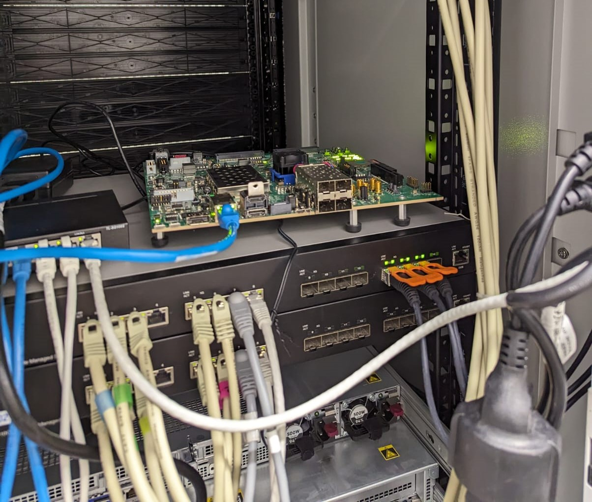

# Satellite Image Cloud Detection Script

## Overview

This Python script monitors a directory for new satellite images, processes them to detect cloud coverage using a pre-trained convolutional neural network, and manages the images based on the results.

**Important:** This script is designed to run on a ZCU102 board.

## Features

- **Preprocessing**: Pads the input satellite images to prepare them for inference.
- **Cloud Detection**: Uses a deep learning model to identify cloud coverage in the images.
- **Automated Processing**: Monitors a directory for new images, processes them, and moves or deletes images based on the cloud coverage percentage.
- **Efficient Execution**: Utilizes a DPU (Deep Processing Unit) for fast and efficient inference.

## Usage

1. **Model Path**: Specify the path to the pre-trained model.
2. **Directories**: Set the directories to monitor for new images and to save processed results.

## Time Results

The experiment was conducted by running inference on the same 20 images both onboard and on a PC.

|                | Model FP32 (on PC) | Model INT8 (on ZCU 102) |
|----------------|------------|------------|
| Average Time   | 0.2503     | 0.0933     |
| Maximum Time   | 0.2861     | 0.1006     |
| Minimum Time   | 0.2145     | 0.0891     |

## The board

