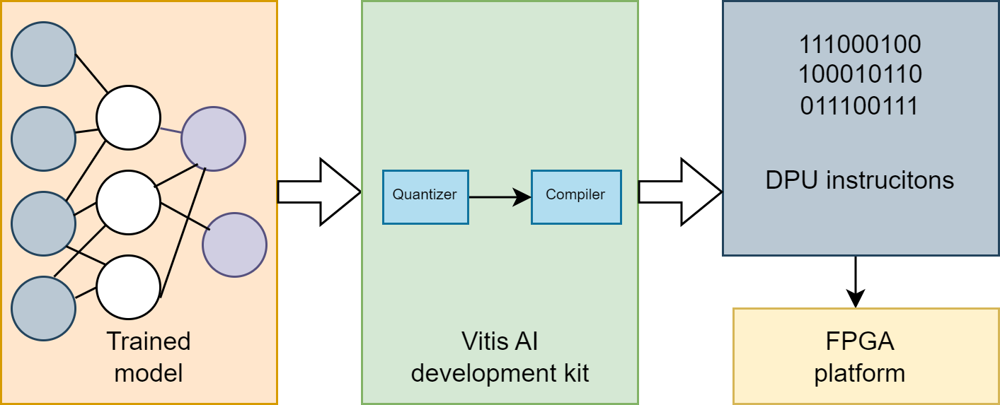

## Model Optimization
The machine learning model used in this project has been optimized using Vitis AI. Vitis AI provides a suite of tools and libraries that enhance the performance and efficiency of AI inference, ensuring optimal execution on supported hardware platforms.

## Quantization Results

The experiment was conducted by running inference on the same 100 images for all dataset dimensions.

| Dataset Dimensions | Accuracy | IOU  | F1 Score |
|--------------------|----------|------|----------|
| **Before Quantization**    | 0.8788   | 0.851 | 0.8301   |
| **Without AdaQuant**       | 0.7419   | 0.6827| 0.5909   |
| 1                  | 0.8553   | 0.8136| 0.7971   |
| 2                  | 0.858    | 0.8281| 0.8058   |
| 3                  | 0.8663   | 0.837 | 0.8122   |
| 4                  | 0.8659   | 0.8351| 0.8095   |
| 5                  | 0.8654   | 0.833 | 0.8079   |
| 6                  | 0.865    | 0.8324| 0.8069   |
| 8                  | 0.8659   | 0.834 | 0.8097   |
| 10                 | 0.8447   | 0.8077| 0.7637   |
| 12                 | 0.8464   | 0.8097| 0.7675   |
| 20                 | 0.8462   | 0.8093| 0.7671   |
