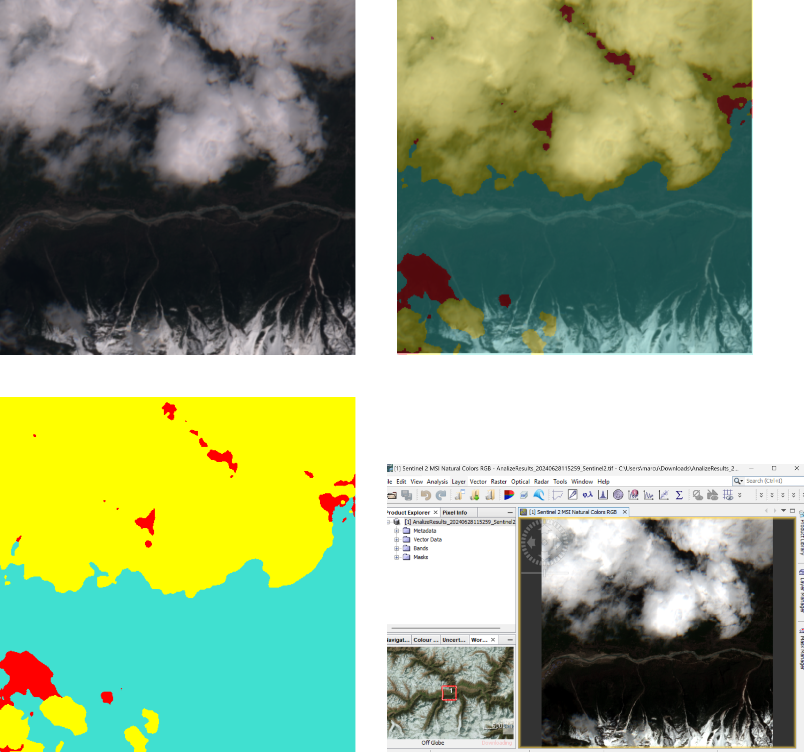

# Multispectral Satellite Image Analysis with AI on Edge

## Overview

This project presents a solution for filtering multispectral satellite images using a convolutional neural network, optimized for implementation on a hybrid architecture development board (ZCU 102). The system detects and removes images with cloud coverage beyond a specified threshold, reducing data volume and processing costs.

## Features

- **Cloud Detection**: Utilizes advanced machine learning algorithms to accurately detect clouds in satellite images.
- **Hybrid Platform**: Implemented on the ZCU 102 development board, offering efficient processing with low energy consumption.
- **Web Application**: Developed using .NET 6 for the backend and React for the frontend, providing an intuitive interface for data distribution and result visualization.

## Benefits

- **Data Transmission Reduction**: Significantly reduces the amount of data transmitted to Earth by filtering out irrelevant images.
- **Cost Efficiency**: Lowers storage and processing costs through on-the-fly data filtering.
- **High Accuracy**: Maintains high accuracy in cloud detection even after optimization for the hybrid platform.
- **Optimized Execution Time**: Enhancements lead to a substantial decrease in execution time, allowing for real-time processing.

## Results

- **High Precision**: Despite optimizations for the hybrid platform, the model retains a high level of precision in detecting clouds.
- **Performance Gains**: Optimizations contribute to a significant reduction in execution time without compromising accuracy.
- **User-Friendly Interface**: The web application allows users to easily access and visualize filtered satellite data and results.

## System Arhitecture

## Project Output

The output of the project is presented in four different formats:

- **Top Left**: RGB Image
- **Top Right**: Overlay between the Cloud Mask and RGB Image
- **Bottom Left**: Cloud Mask
- **Bottom Right**: Sentinel-2 Image opened with the SNAP application

